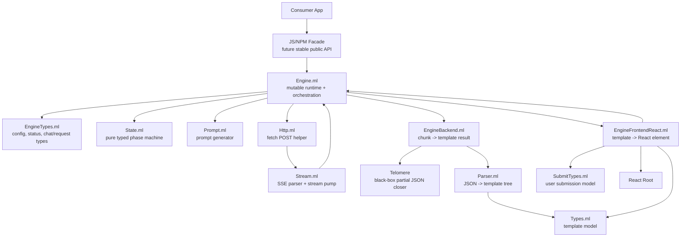
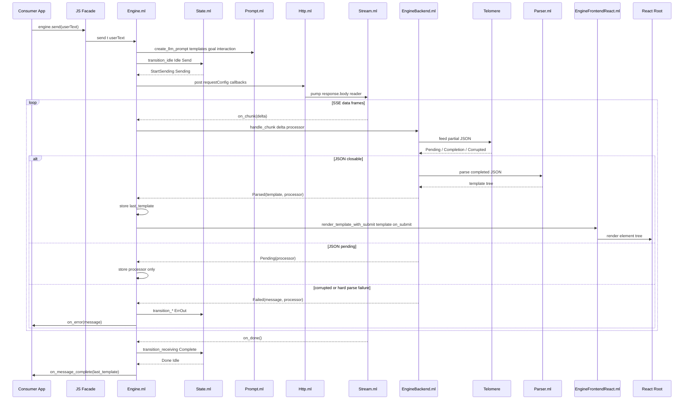
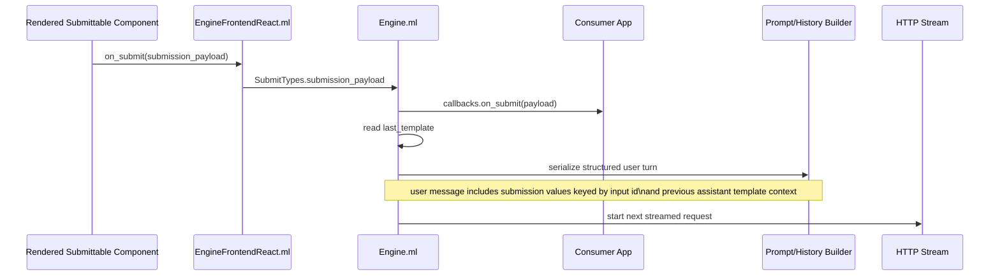
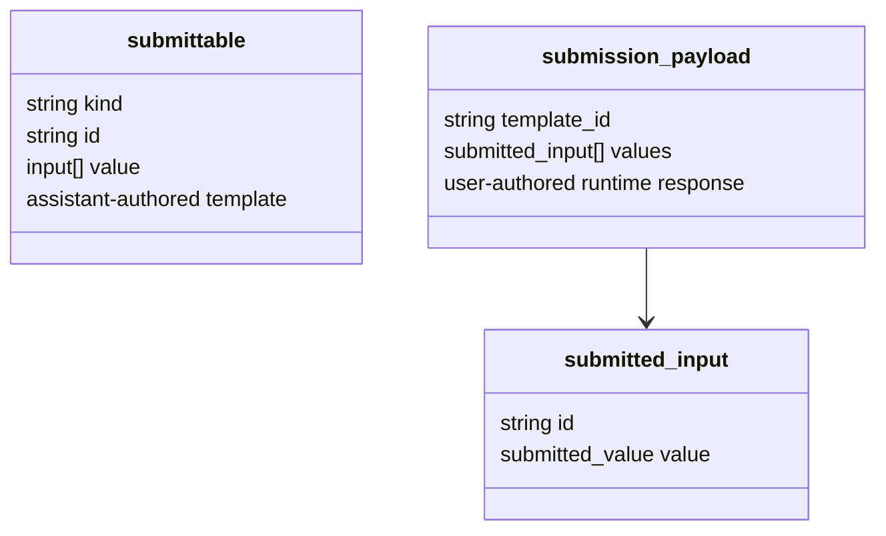
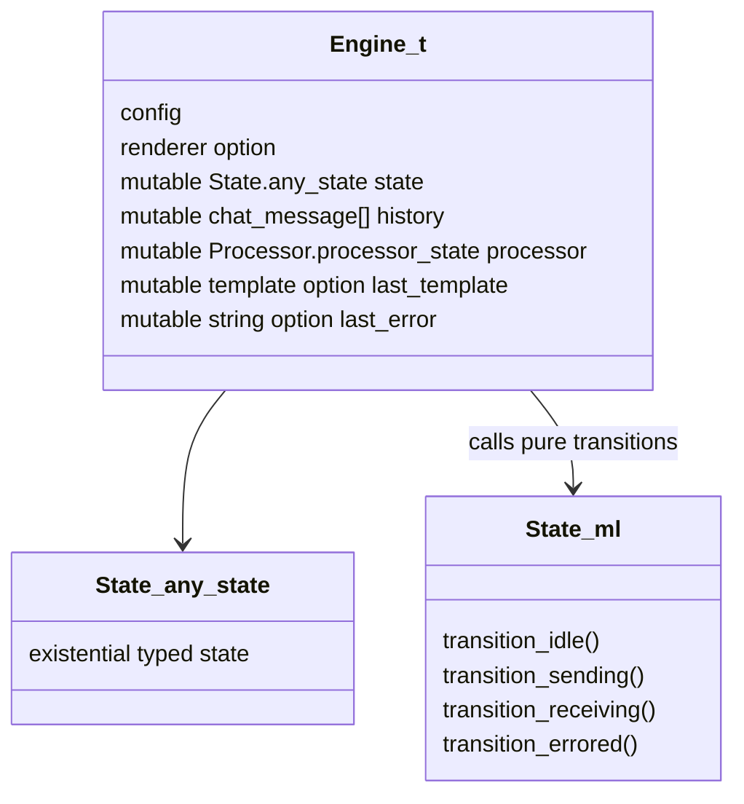
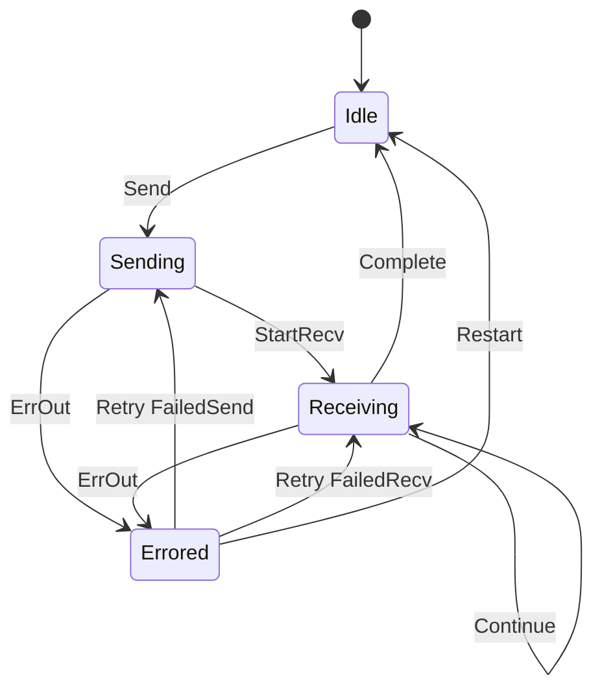
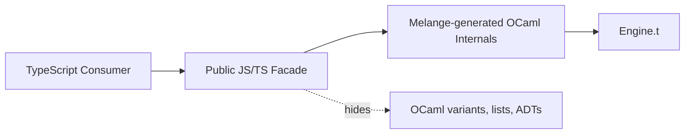
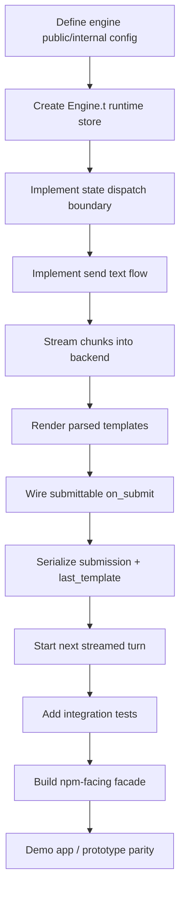

# Ribosome UI Architecture

This document describes the Phase 2 architecture target: streamed structured JSON from an inference backend becomes a rendered React UI, and structured user submissions loop back into the next model turn.

Telomere is treated as a black box here: it receives incremental JSON text and returns enough completion data to parse the current partial response when possible.

## Module Map



## Runtime Data Flow



## Structured Submit Loop



The submission payload is user-authored runtime data, not part of the assistant-authored template model.



## Engine Runtime Store

`Engine.ml` is the effect boundary. It owns the mutable runtime state and interprets pure state transitions.



The state machine does not know about HTTP, React, Telomere, prompts, or providers. It only models the logical phase:



## Public Package Boundary

The final npm package should expose a small JS/TS facade rather than raw Melange-generated OCaml shapes.



Target public shape:

```ts
type RibosomeEngine = {
  send(prompt: string): Promise<void>;
  submit(payload: SubmissionPayload): Promise<void>;
  reset(): void;
  status(): EngineStatus;
  history(): ChatMessage[];
};
```

The facade should convert between JS-native objects and internal Melange values so consumers never construct OCaml ADTs or lists directly.

## Phase 2 Completion Checklist


