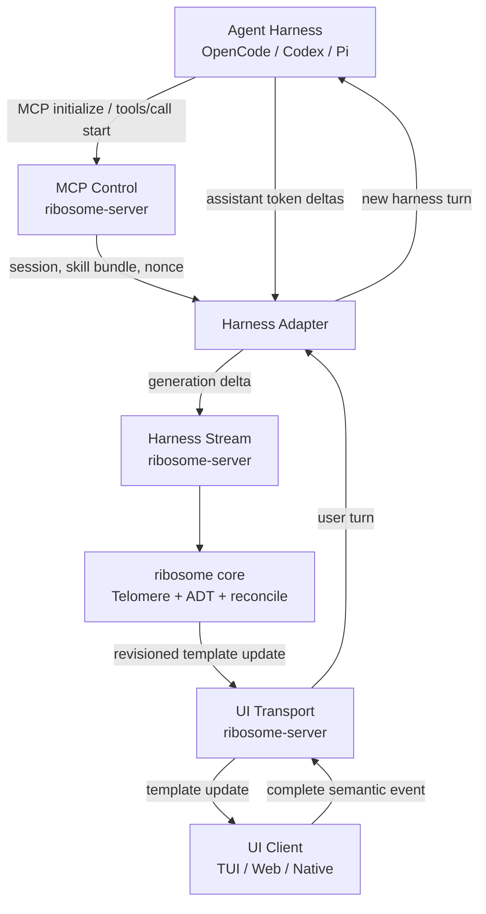
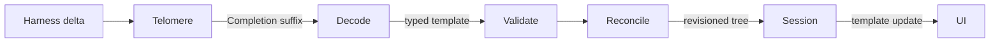
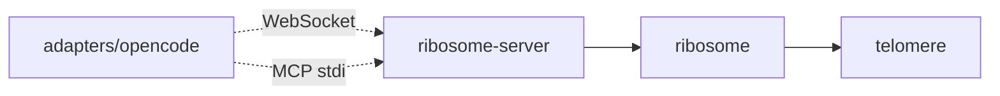
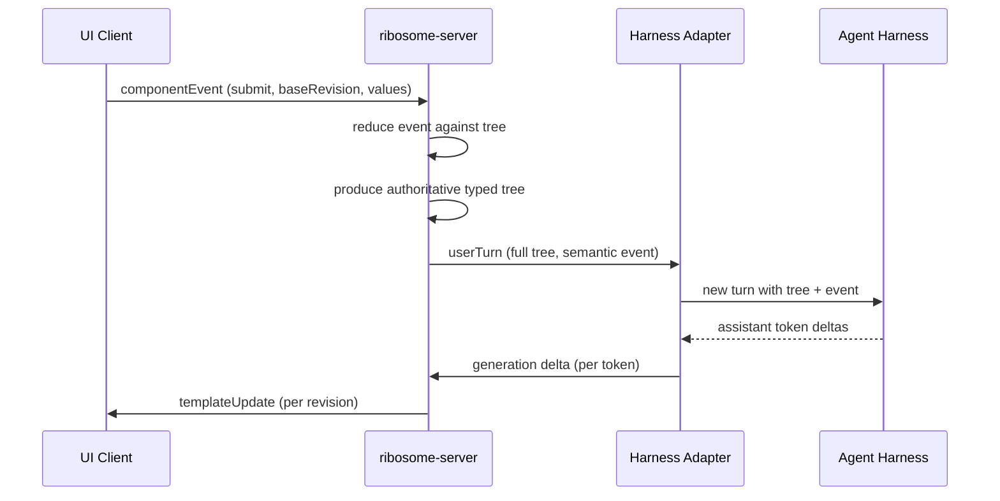

# Ribosome Architecture

Ribosome is a native OCaml server that turns a coding-agent harness into a generative-UI runtime. An agent calls Ribosome through MCP to start a UI turn; the harness forwards raw assistant token deltas over a dedicated streaming channel; Ribosome feeds every delta through Telomere, decodes closable candidates into a fixed typed template ADT, reconciles them by stable ID, and broadcasts revisioned updates to any attached UI client. User submissions travel back over the UI channel as one complete semantic event, become one authoritative typed tree, and start the next agent turn through the harness adapter.

## Invariants

- Every generated template delta passes through Telomere. No path may batch, debounce, or bypass token-level streaming.
- `ribosome` owns a closed OCaml template ADT. Clients do not define template kinds.
- The core knows nothing about MCP, Dream, WebSockets, OpenCode, Codex, or rendering.
- WebSockets are one server adapter, not the core UI abstraction.
- MCP is the control plane, not the delta transport.
- Submissions are complete trees, never token-streamed back to the harness.
- The only retained TypeScript is a thin harness adapter where the host requires it.

## Planes



### MCP control plane

The harness calls Ribosome as an MCP server over stdio. Ribosome implements a minimal tested subset: `initialize`, `notifications/initialized`, `ping`, `tools/list`, and one tool `start`. The `start` tool accepts a mode (default `ui`), plus adapter-injected harness session ID and a channel nonce. Its result returns session metadata as structured content and the selected skill body as model-visible content, ending with instructions that the next assistant response must be raw template JSON only. MCP is not used to transport deltas; standard `tools/call` delivers only complete arguments.

### Harness stream plane

After kickoff, the harness adapter opens a WebSocket to `/v1/harness` and authenticates with the nonce injected at `start`. It forwards every native assistant delta as one harness delta message carrying generation ID and a monotonically increasing sequence number. Terminal generation events become `completed` or `failed`. The server sends `userTurn` messages back to the adapter, each containing the full authoritative typed tree plus the semantic event; the adapter starts the next harness turn through the host's native session API. The harness protocol transports raw deltas without knowing OpenCode, Codex, or Pi types.

### Core pipeline



Every delta feeds `Telomere.Processor.feed`. On `Completion suffix`, Ribosome decodes `buffer ^ suffix` into the typed ADT, validates invariants, and reconciles against the committed tree by stable ID. Valid commits increment the session revision and emit a template update. Decode, validation, and reconciliation failures do not mutate committed state while generation continues. Corrupted processors permanently stop candidate commits.

### UI plane

UI clients attach over WebSocket to `/v1/ui` with their session nonce. On attach they receive the current `sessionState` snapshot. Each committed revision broadcasts a `templateUpdate`. Clients send `componentEvent` messages (`click`, `change`, `submit`) carrying event ID and base revision. `change` events apply locally and broadcast immediately; `click` and `submit` events produce one `userTurn` for the harness adapter. Stale revisions and duplicate event IDs are rejected. Reconnect from a known revision resends the snapshot.

## Packages



| Package | Responsibility | Dependencies |
|---|---|---|
| `telomere` | Incremental JSON completion | OCaml stdlib |
| `ribosome` | Typed template ADT, codec, validation, reconciliation, session state, modes | `telomere`, `yojson` |
| `ribosome-server` | MCP subset, harness and UI protocols, Dream WebSocket transport, session registry, runtime | `ribosome`, `yojson`, `lwt`, `dream`, `cmdliner` |
| `adapters/opencode` | Thin TypeScript harness adapter | `@opencode-ai/plugin`, Bun |

Test dependencies: `alcotest`, `alcotest-lwt`, `qcheck-core`, `qcheck-alcotest`.

## Target Layout

```text
dune-project
dune
telomere/        src/ test/
ribosome/        src/template/ src/codec/ test/
ribosome-server/ src/ bin/ test/
adapters/opencode/
skills/ribosome/SKILL.md
protocol-fixtures/
architecture.md
plan.md
README.md
```

## Template Model

Ribosome ships a closed ADT. The initial primitive set matches the `ratatui-port` reference:

- `text` (Paragraph, H1-H6) with `value`
- `image` (`src`, `alt`)
- `badge` (`label`, `variant`)
- `stat` (`label`, `value`, optional `secondary`)
- `divider` (optional `label`)
- `diagram` (`title`, `size`, typed primitives: text, line, arrow, rectangle, circle, polyline with tones)
- `code` (`path`, `language`, `line_start`, `source`, typed highlights with tones)
- `container` (`direction`: Vertical | Horizontal, `children`)
- `list` (optional `ordered`, `children`)
- `submittable` (`value` of input/select fields, optional `button`)
- `input` (string or int `value`)
- `select` (`label`, `options`, optional `selected`)
- `button` (`label`, `action`: Submit | Navigate | Custom)

There is no public `Broken` variant; decode failures are errors while generation continues. Nested-only kinds (`input`, `select`, `button`) are rejected at the root.

## Session State

```ocaml
type session = {
  id: string;
  mode: Mode.t;
  tree: Template.t option;
  revision: int;
  generation: generation option;
  stream: Incremental.state;
  ui_connections: connection list;
  harness_connection: connection option;
  recent_event_ids: string list;
}
```

Generation IDs are opaque strings. Deltas carry monotonically increasing sequence numbers. Telomere state resets at generation start while preserving the committed tree. Event IDs are deduplicated within a bounded window. The core session type contains no Codex, OpenCode, Dream, or WebSocket types.

## Submission Flow



No user input is token-streamed back. The complete tree is submitted at once, the adapter serializes it once, and the harness sees one new user turn.

## Modes And Skills

A mode is a named bundle of skill references. The initial overhaul ships only the `ui` mode, which returns the canonical `skills/ribosome/SKILL.md`. The skill is updated for container direction, code, and diagram primitives, and states that the next assistant response must be raw template JSON only. The mode registry supports adding `code`, `explore`, and other modes later without core changes. The skill is checked against the canonical template registry so every advertised kind exists in the ADT.

## Harness Adapters

Each harness needs a thin adapter that:

- Correlates the Ribosome MCP `start` call with the native harness session.
- Captures assistant token deltas from the host's streaming events.
- Forwards one harness delta per native delta without batching.
- Maps host completion/error events to harness `completed`/`failed`.
- Decodes server `userTurn` messages and starts the next native turn.
- Carries sequence numbers and generation IDs.

OpenCode exposes `message.part.delta` events; Pi exposes `message_update` with `assistantMessageEvent.text_delta`; Codex App Server exposes `item/agentMessage/delta`. The first complete vertical slice targets OpenCode. The adapter is the only required TypeScript package.

## Telomere

Telomere is the incremental JSON completion layer. It receives streamed text and answers: given the prefix so far, can this be closed into valid JSON now? It is mandatory in the streaming path and is Ribosome's competitive advantage over other generative-UI frameworks.

```ocaml
type processor_state
type output = Pending | Completion of string | Corrupted

val create_processor : unit -> processor_state
val feed : processor_state -> string -> output * processor_state
```

`Pending` means the stream is mid-token. `Completion suffix` means `buffer ^ suffix` is valid JSON ready to decode. `Corrupted` permanently stops candidate commits for that processor. State is immutable; callers thread the returned state forward.

## Future Work

- Additional modes (`code`, `explore`) with distinct skill bundles.
- Broader MCP operations beyond `start`.
- Additional harness adapters (Codex, Pi).
- Native, web, and TUI UI clients built against the versioned UI protocol.
- Optional streaming submission for large trees if a future harness supports it.
