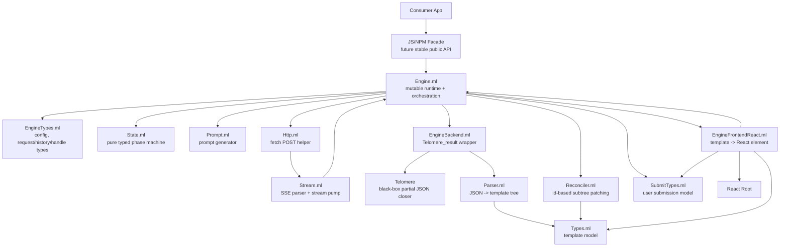
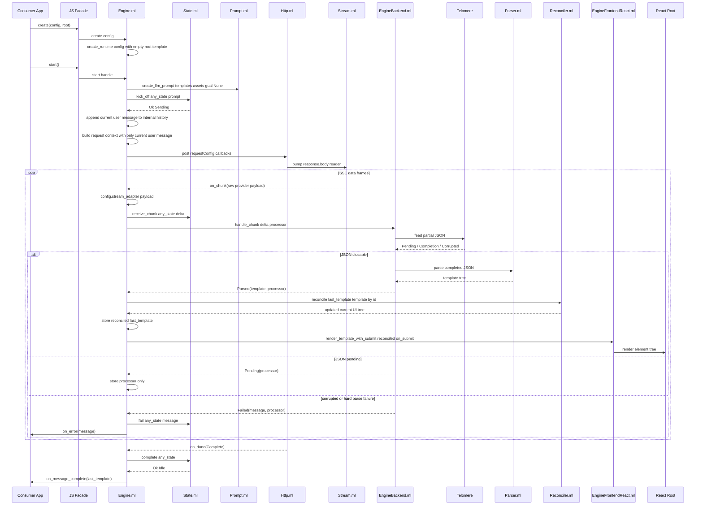
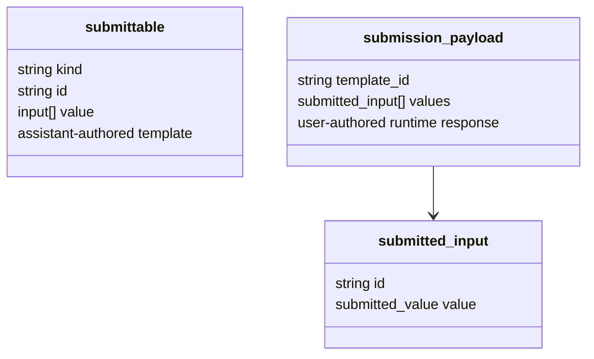
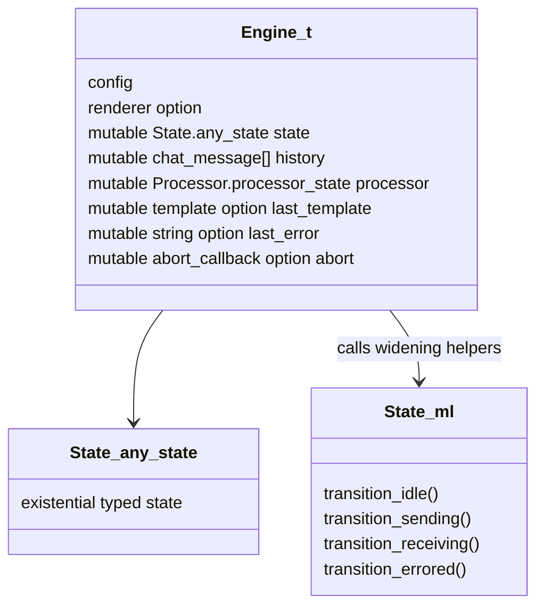
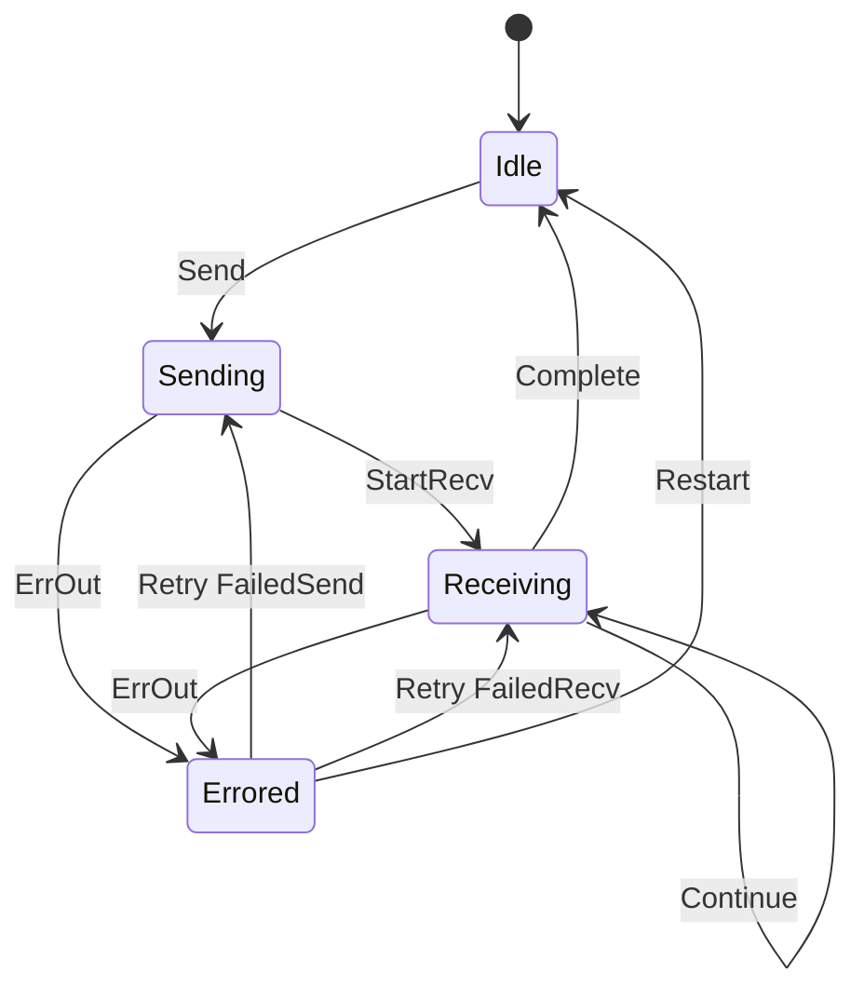
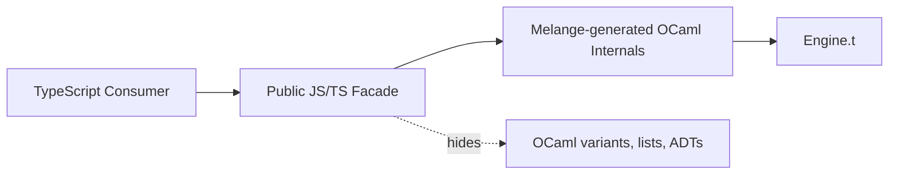
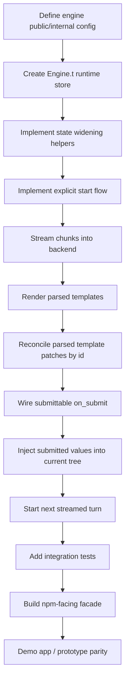

# Ribosome UI Architecture

This document describes the current Phase 2 architecture: streamed structured JSON from an inference backend becomes a rendered React UI tree, and user submissions are injected back into that tree before the next model turn.

Telomere is treated as a black box here: it receives incremental JSON text and returns enough completion data to parse the current partial response when possible.

## Module Map



## Runtime Data Flow



## Structured Submit Loop

```mermaid
sequenceDiagram
  participant React as Rendered Submittable Component
  participant Frontend as EngineFrontendReact.ml
  participant Engine as Engine.ml
  participant SubmitTypes as SubmitTypes.ml
  participant App as Consumer App
  participant Prompt as Prompt.ml
  participant Http as HTTP Stream

  React->>Frontend: on_submit(submission_payload)
  Frontend->>Engine: SubmitTypes.submission_payload
  Engine->>App: callbacks.on_submit(payload)
  Engine->>SubmitTypes: inject_user_input last_template payload.values
  SubmitTypes-->>Engine: current UI tree with submitted values
  Engine->>SubmitTypes: serialise_template tree
  Engine->>Prompt: create_llm_prompt templates assets goal None
  Note over Engine,Prompt: every turn repeats schema and output contract;\nthe user message is the current UI tree JSON
  Engine->>Http: start next streamed request
```

The submission payload is user-authored runtime data at the frontend boundary. Before the next model turn, the engine injects those values into the current assistant-authored template tree and serializes that tree as the next user message.

The consumer app does not call submit directly. `EngineFrontendReact` injects an internal submit callback into rendered submittable components, and that callback starts the next model turn inside the library.



## Engine Runtime Store

`Engine.ml` is the effect boundary. It owns the mutable runtime state and interprets pure state transitions.



The state machine does not know about HTTP, React, Telomere, prompts, or providers. It only models the logical phase:



`State.ml` keeps typed GADT transitions internally. Because `Engine.ml` is a mutable async runtime, it stores `State.any_state`; phase widening is kept behind small state helpers such as `kick_off`, `receive_chunk`, `complete`, and `fail` rather than duplicated in the engine.

`Engine.ml` starts with a synthetic empty root template:

```json
{ "kind": "container", "id": "root", "children": [] }
```

Every parsed model response is treated as a patch against the current tree. If the patch root `id` matches an existing node, `Reconciler.ml` replaces that node and preserves the rest of the tree. If no matching `id` is found, the engine replaces the whole root with the parsed template.

`Engine.ml` keeps a simple internal history of user messages, but the current request context sends only the current turn's user message. Assistant raw stream buffers are not appended to history. The prompt tells the model that the user message contains the current UI tree as JSON, including user input values from the previous interaction.

`Engine.ml` also stores an abort callback for the current fetch. `reset` aborts in-flight work. Each accepted turn resets turn-local processor and error state before installing the next request's abort handle.

## Provider And HTTP Boundaries

`Http.ml` contains the JavaScript async boundary. It starts `fetch`, pumps the stream, catches promise failures internally, and reports outcomes through callbacks rather than exposing promise rejection through the engine API.
The engine passes an `AbortSignal` for each request so reset can cancel in-flight work without reporting a user-visible error.

```ocaml
type completion_reason =
  | Complete
  | Failed of string
```

`Stream.ml` parses SSE framing and pumps raw `data:` payloads. Provider-specific response shapes are abstracted by:

```ocaml
type stream_adapter = string -> (string option, string) result
```

The engine sees only extracted text deltas. Provider details such as OpenAI-shaped JSON or sentinel payloads belong in adapter modules, not in `Engine.ml`.

## Public Package Boundary

The final npm package should expose a small JS/TS facade rather than raw Melange-generated OCaml shapes.



Target public shape:

```ts
type RibosomeEngine = {
  start(): void;
  reset(): void;
  history(): ChatMessage[];
};
```

Creating the engine prepares the runtime and renderer. The consumer starts the initial UI turn by calling `start()`. User interaction proceeds through rendered UI submit callbacks owned by the library. The current external lifecycle controls are start, reset, and history inspection.

The facade should convert between JS-native objects and internal Melange values so consumers never construct OCaml ADTs or lists directly.

## Phase 2 Completion Checklist



## Telomere Internals And Interface

Telomere is the incremental JSON completion layer used between streamed text deltas and template parsing. It does not know about Ribosome templates, React, providers, HTTP, prompts, or conversation history. Its job is to answer: given the text streamed so far, can this prefix be closed into valid JSON now?

### Public Processor Interface

The engine-facing interface is `Telomere.Processor`:

```ocaml
type processor_state = {
  balancer : Balancer.balancer_state;
  buffer : string;
}

type output =
  | Pending
  | Completion of string
  | Corrupted

val create_processor : unit -> processor_state

val feed : processor_state -> string -> output * processor_state
```

`processor_state.buffer` is the raw accumulated model output for the current turn. The engine uses it only while processing that stream; successful assistant buffers are not stored as history.

`feed` appends the incoming chunk to `buffer`, passes the chunk through the balancer, and returns a fresh processor state. Telomere state is immutable from the caller's perspective; callers must store the returned state.

### Output Semantics

`Pending` means the current stream cannot yet be cleanly closed into JSON. The engine should store the returned processor state and wait for more chunks.

`Completion suffix` means the current buffer can be made valid JSON by appending `suffix`. `EngineBackend.handle_chunk` parses `processor_state.buffer ^ suffix` into a Ribosome template. A healthy parsed template can be reconciled and rendered immediately.

`Corrupted` means the stream encountered an invalid JSON transition or mismatched closer. The engine treats this as a hard stream failure.

### Balancer State

`Balancer.balancer_state` tracks enough lexer/parser state to compute a completion suffix:

```ocaml
type balancer_state = {
  closing_stack : closing_token list;
  json_state : json_state;
  is_corrupted : bool;
}
```

`closing_stack` stores the closers needed to finish currently open structures. Opening `{`, `[`, object keys, and string values push corresponding closing tokens. Matching close tokens pop them. A mismatched close corrupts the state.

`json_state` tracks where the parser is within JSON syntax: object, array, key, value, string, number/literal prefix, nested value completion, or pending top-level state.

`is_corrupted` poisons the balancer after a hard error. Once corrupted, future chunks keep returning `Corrupted` rather than attempting recovery inside the same processor.

### Clean Closability

Telomere only emits a `Completion` when the current `json_state` is cleanly closable. Examples include:

- before any input or after a full document has closed
- an empty object or array
- a closed string value
- a complete number/literal prefix
- a fully closed nested object or array value

If the current state is inside an open string, partial key, incomplete literal, or otherwise syntactically unfinished position, the result is `Pending`.

When cleanly closable, Telomere converts `closing_stack` into a suffix by reversing the stack and mapping each closing token to its character:

```ocaml
CloseBrace -> '}'
CloseBracket -> ']'
CloseKey -> '"'
CloseStringData -> '"'
```

### Error Semantics

Telomere distinguishes soft not-yet-closable states from hard corruption.

`NotClosable` is a soft result. It means the current prefix may become valid after more input, so `Processor.feed` returns `Pending`.

Hard lexer/parser errors and stack corruption mark the balancer corrupted. `Processor.feed` returns `Corrupted`, and `EngineBackend.handle_chunk` maps that to `Telomere_result.Failed`.

### EngineBackend Wrapper

`EngineBackend.ml` wraps Telomere for Ribosome-specific use:

```ocaml
module Telomere_result : sig
  type t =
    | Pending of Processor.processor_state
    | Parsed of Types.template * Processor.processor_state
    | Failed of string * Processor.processor_state
end

val handle_chunk : string -> Processor.processor_state -> Telomere_result.t
```

This wrapper is where Telomere output becomes a Ribosome template result:

- `Pending` stays pending.
- `Completion suffix` is parsed as `processor_state.buffer ^ suffix`.
- parser success becomes `Parsed` when the parsed tree is healthy.
- soft broken template nodes are treated as `Pending`, because later bytes may turn the partial tree into a valid specialized template.
- hard broken template nodes, hard parser failure, or Telomere corruption become `Failed`.

This keeps Telomere generic while allowing the engine to work in terms of rendered templates.
